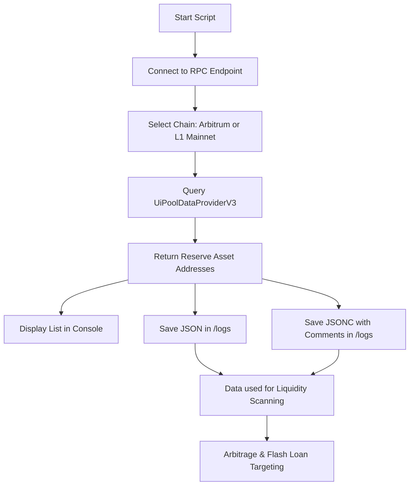

## 📜 Reserve List Fetching Scripts

### Overview

The scripts `scripts/fetchAaveReserveList.js` and `scripts/fetchRadiantReserveList.js` are **protocol data-fetching utilities** designed to query the **UiPoolDataProviderV3** contracts on-chain.

They serve as **entry points for identifying available token markets** on lending protocols (Aave V3, Radiant Capital), which is essential for:

* **Liquidity monitoring** — tracking available assets for lending/borrowing.
* **Arbitrage opportunity scanning** — knowing all supported assets across protocols is the first step for detecting profitable trades.
* **Flash loan targeting** — determining eligible assets for borrowing.
* **Risk and portfolio analysis** — mapping assets to price feeds, health factors, etc.

---

### ✨ Key Features

* Supports **both Arbitrum** and **Ethereum Mainnet (L1)** with minimal code changes (just swap chain configuration & contract addresses).
* Outputs a clean list of token addresses to:

  * **Console** (human-readable)
  * **JSON file** in `/logs` (for storage & automation)
  * **JSONC file** in `/logs` (same data, but with inline comments for documentation)
* Minimal ABI for fast execution — no full ABI parsing required.
* Easily extended to fetch **liquidity, interest rates, and configuration data** per reserve.

---

### ⚙️ Usage

```bash
# Fetch Aave reserve list on Arbitrum
node scripts/fetchAaveReserveList.js

# (Optional) Fetch for Mainnet by editing:
# - RPC URL to Ethereum mainnet
# - UI_POOL_DATA_PROVIDER & POOL_ADDRESS_PROVIDER constants
```

For **Ethereum Mainnet**, use:

```js
import { mainnet } from 'viem/chains';
const publicClient = createPublicClient({
  chain: mainnet,
  transport: http('https://eth.llamarpc.com'), // or any reliable ETH RPC
});
```

---

### 📂 Output Files

When run, the script will create/update:

* **`/logs/AaveReserveList.json`** → raw machine-readable output.
* **`/logs/AaveReserveList.jsonc`** → same data, but with human-friendly comments.

---

### 🔍 Workflow (Mermaid Diagram)



---

### 💡 Essence

These scripts are **foundational** to the repo’s liquidity intelligence layer.
Without knowing which reserves exist, you **can’t**:

* Match cross-protocol assets for arbitrage.
* Identify underutilized liquidity.
* Target optimal flash loan markets.
* Run protocol-wide health/risk simulations.

Think of them as the **directory of the battlefield** — you can’t fight if you don’t know where the targets are.

---
