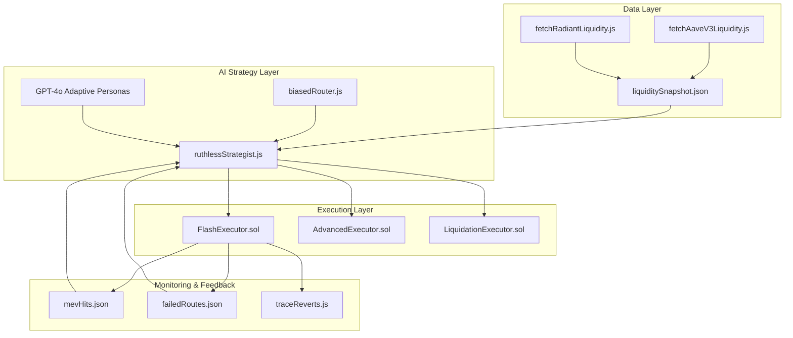

# 📊 Liquidity Snapshot Modules — Aave & Radiant

## Overview

These modules continuously fetch **live liquidity availability** from:

* **Aave V3** (on Arbitrum)
* **Radiant Capital** (on Arbitrum)

They output structured JSON snapshots into your bot’s data directory, updating every loop.
This data is not just for display — it **directly powers** our AI-driven master controller (`runtime/ruthlessStrategist.js` & `runtime/control.js`).

---

## 🚀 Purpose in the Revenant Stack

Most MEV bots hardcode their flashloan amount like this:

```js
loanAmount: process.env.AMOUNT || "1000"
```

That’s static, brittle, and guaranteed to miss optimal profits.

**Revenant** does it differently:

1. **Measure available liquidity each cycle**
2. **Pass that to the strategist AI**
3. **Dynamically select the loan size** — adapting in real time to market depth

---

## 🔥 How It Works

**Flowchart — Liquidity to Execution**

<pre> ```mermaid flowchart LR A[Fetch Aave Liquidity] --> D[Save to liquiditySnapshot.json] B[Fetch Radiant Liquidity] --> D D --> E[Feed into ruthlessStrategist.js] E --> F{AI Decision} F -->|Safe Mode| G[Execute Conservative Flashloan] F -->|Aggressive Mode| H[executeReckless()] G --> I[Trade Execution on DEXs] H --> I I --> J[Profit / Log Results] ``` </pre>

---

## 🧠 The AI Advantage

Unlike static bots, Revenant:

* **Thinks before acting**: GPT reroutes, adapts, learns from bad trades
* **Monitors health**: Escalates only when patterns show high ROI potential
* **Has a memory**: Uses `mevHits.json`, `failedRoutes.json` to bias future routing

---

## Example: Aggressive Mode Trigger

`runtime/ruthlessStrategist.js` watches liquidity data:

```js
if (availableLiquidity > lastCycleLiquidity * 1.5 && roiTrendPositive) {
    maybeGoRuthless();
}
```

When triggered:

```solidity
executeReckless(
    [WETH],
    [maxAvailableLoan],
    [0],
    dexSequence,
    tokenPath
);
```

---

## 📐 Architecture Context

**System Overview**



---

## 📌 Vision

This is **not** a fork-and-pray bot.
It’s an **adaptive, modular, AI-driven trading engine** that:

* Reacts to *real liquidity conditions*
* Adjusts its own risk tolerance
* Evolves its routing strategies over time

---
