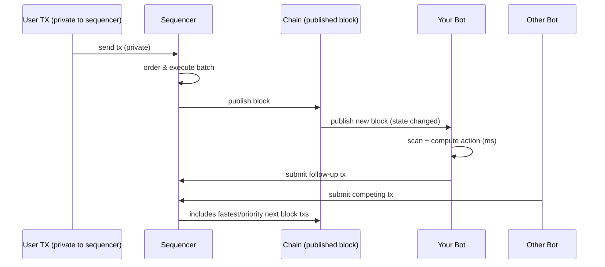
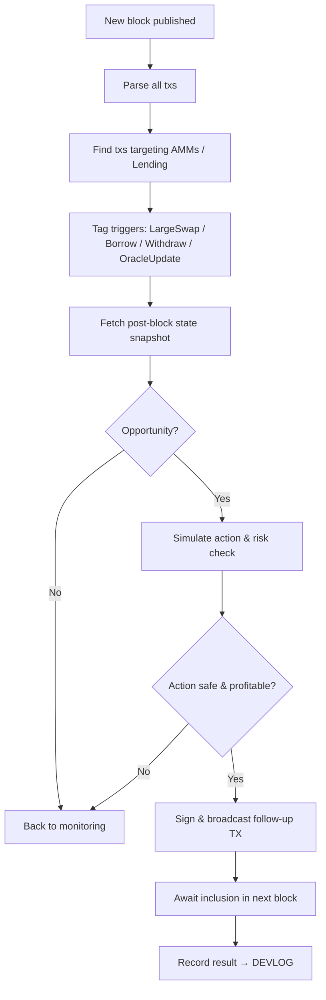
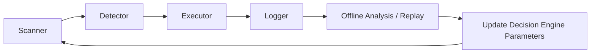
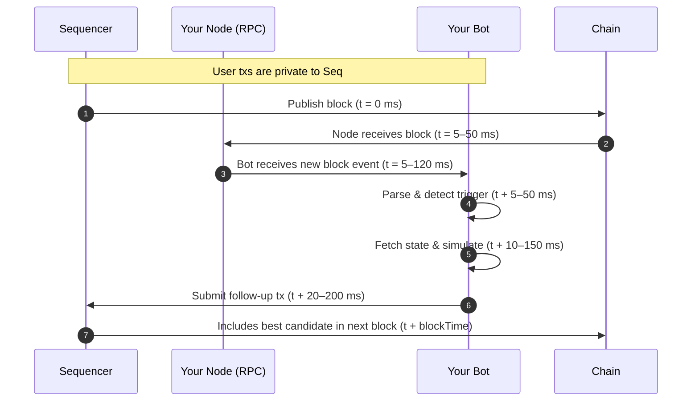

# State-Change Arbitrage (Post-Sequencer MEV)

> Detailed README explaining the tactic, lifecycle diagrams, simulations with numbers, and a log-like flow for building reactive MEV strategies on Arbitrum (and L1).

---

# Overview

**Tactic name:** *State-change arbitrage* (also: post-trade reactive arbitrage, post-sequencer MEV, event-driven arbitrage)

**Short definition:** instead of trying to see/attack transactions in a public mempool before they execute, you scan newly published blocks for state changes (price shifts, liquidations, vault rebalances), then react immediately — racing other bots to have your follow-up transaction included in the next block.

This approach is the canonical way to extract MEV on **rollups with no public global mempool (Arbitrum, Optimism, etc.)**, and it also works on L1 where you can optionally combine both mempool and post-trade tactics.

---

# Why use it?

* **Works on Arbitrum**: sequencer publishes executed batch → you see final state → you act.
* **Lower wasted gas**: you act on verified state rather than speculative mempool bets.
* **Actionable events**: large swaps, oracle updates, collateral withdrawals create deterministic state changes you can evaluate precisely.
* **Composable**: same pattern applies to liquidations, arbitrage, vault rebalances, forked AMM price moves, etc.

---

# Components (implementation map)

* **Block Watcher** — subscribes to new blocks (or `pending` on L1). Parses txs in the block for interactions with target contracts.
* **Trigger Detector** — filters transactions that matter (liquidation calls, large swaps, oracle owner changes, liquidity burn/mint).
* **State Snapshot Module** — after detection, immediately queries fresh on-chain state (e.g., `getUserAccountData()`, AMM reserves, on-chain oracles).
* **Decision Engine** — runs your profitability checks and risk rules (simulate slippage, gas, market depth).
* **Executor** — crafts, signs, and submits the follow-up tx (liquidation, arbitrage) to be included as fast as possible.
* **Submission Channel** — normal RPC to sequencer; optionally private relay or RPC pool to reduce latency.
* **Logging / DEVLOG** — every detection → action → result must be logged to the DEVLOG for audit and tuning.

---

# End-to-end flow (high-level)

```mermaid
graph TD
    A[Sequencer publishes block] --> B[Bot: parse transactions]
    B --> C{Transaction touches target contracts?}
    C -- No --> B
    C -- Yes --> D[Fetch immediate state snapshot]
    D --> E{Is there a profitable opportunity?}
    E -- No --> B
    E -- Yes --> F[Craft & sign transaction]
    F --> G[Submit to sequencer (next block)]
    G --> H[Inclusion & profit (or fail)]
    H --> I[Log outcome / learn]
```

---

# Timeline (sequence) — how the race looks



---

# Log-style flow

```
[BLOCK #N] → scanned 142 txs
  - TX 0xabc... touched UniswapV3 pool (swap 5M USDC → WETH)
  - TX 0xdef... touched Aave pool (withdraw 100 ETH)
Trigger: UniswapV3 big swap -> AMM price shifted +0.8%
Action: compute cross-DEX arbitrage (Sushi vs Uni)
Decision: simulate -> profitable
Executor: craft swap (Sushi buy WETH), sign, submit to sequencer
Result: included in Block #N+1 → profit: +$11.84 (after gas)
DEVLOG: add entry [block N] with details and timing metrics
```

---

# Lifecycle diagrams (detailed)

## 1) Detection → Execute (block-by-block)



## 2) Log & Learn loop (how you train the strategy over time)



---

# Simulations & numeric examples

> **Important:** numbers below are simple illustrative simulations — they simplify real on-chain complexity (slippage curves, AMM depth, gas variance, fees). Use them to understand the mechanics and tune your models, not as guaranteed outcomes.

All USD conversions use `ETH = $4,080` for these examples.

---

## Example A — Arbitrage (cross-DEX) simulation

**Scenario:**

* Large swap on Uniswap moves price of `TOKEN`:

  * Uni V3 price (after swap): `102 USDC / TOKEN`
  * Sushi price remains: `100 USDC / TOKEN`
* You can buy `10 TOKEN` on Sushi at `100`, sell on Uni at `102`.
* Gas cost for your arbitrage tx: `0.002 ETH`.

**Calculations (digit-by-digit):**

* Buy cost = `100 USDC/token * 10 token = 100 * 10 = 1000 USDC`

* Sell proceeds = `102 USDC/token * 10 token = 102 * 10 = 1020 USDC`

* Gross profit = `1020 - 1000 = 20 USDC`reponsibity

* Gas in USD = `0.002 ETH * 4080 USD/ETH`

  * `0.002 * 4080 = 8.16 USD`

* Net profit = `gross profit - gas`

  * `20 - 8.16 = 11.84 USD`

**Result:** Net profit ≈ **\$11.84**.
(Example used numbers above — if gas or slippage is larger, profit disappears; simulation must include slippage + price impact.)

---

## Example B — Liquidation simulation

**Scenario:**

* Borrower on Aave/Radiant:

  * Collateral: `2 ETH`
  * Debt: `7000 USDC`
* `ETH = $4,080` → Collateral value = `2 * 4080 = 8160 USD`
* Close factor = `50%` → you can repay up to `3500 USDC` of the debt
* Liquidation bonus (incentive) = `5%`
* Gas cost for liquidation tx = `0.003 ETH`

**Calculations:**

* Repay amount = `7000 * 0.5 = 3500 USD`
* Seized value = `repay * (1 + 0.05) = 3500 * 1.05 = 3675 USD`
* Seized ETH = `3675 / 4080 ≈ 0.9007352941 ETH` (you receive this much ETH collateral)
* Gas cost USD = `0.003 * 4080 = 12.24 USD`
* Gross liquidation profit = `seized_value - repay = 3675 - 3500 = 175 USD`
* Net profit after gas = `175 - 12.24 = 162.76 USD`

**Result:** Net profit ≈ **\$162.76** in this example.

---

# How timing & latency affect outcomes

* **Detection latency** = time from block publication → your bot detects relevant tx. Aim for milliseconds.
* **Computation latency** = running simulations and checks. Keep this <100–300ms if possible.
* **Submission latency** = time to sign & send tx. Use local signer & persistent keep-alive RPC/WebSocket to the sequencer.
* **Network inclusion** = your next-block inclusion odds depend on how many competitors submit and any priority fee structure.

**Key optimization levers:**

* colocated low-latency nodes (well-connected RPC)
* pre-warmed transaction templates (avoid heavy runtime encoding)
* local signing & account nonce management
* parallelization: compute multiple candidate actions simultaneously
* gas bidding / priority fee if applicable

---

# When to prefer this tactic vs classic mempool tactics

* Use **mempool sniping/sandwich** on L1 where you have reliable access to the mempool and can meaningfully out-bid or reorder.
* Use **state-change tactics** on rollups (Arbitrum, Optimism) or when mempool access is limited — this is the dominant pattern on Arbitrum.
* Hybrid: on L1 you can combine both — mempool listens + block post-scan failsafe.

---

# Implementation checklist (practical)

1. **Provider selection**
   * Arbitrum: use fast private/public RPC or sequencer-connected provider; fallback to block subscription.
   * L1: use `pending` subscription where available.

2. **Block watcher**

   * Subscribe to `provider.on('block', ...)` (Arbitrum) or `pending` (L1).

3. **TX parsing**

   * Quickly scan each txn `to` address + first 4 bytes of `data` to filter target interactions.

4. **State fetch**

   * After trigger, call minimal `view` functions required:

     * Lending: `getUserAccountData()`, `getReserveData()`
     * AMM: `getReserves()` / `slot0` / `getAmountsOut()` for base estimates
     * Oracle: `latestAnswer()` where relevant

5. **Simulation**

   * Simulate expected slippage & execution path (multi-hop).
   * Conservative slippage thresholds to avoid failed/unprofitable TXs.

6. **Executor**

   * Craft optimal calldata, sign locally, submit via low-latency RPC.
   * Consider pre-funded gas/premium to improve inclusion odds.

7. **Logging**

   * Write structured DEVLOG entry: block number, trigger tx hash, detection time, simulation result, submitted tx hash, final inclusion, profit/loss, errors.

---

# DEVLOG entry template (machine/human friendly)

```
# DevLog — Entry ####
Date: 2025-08-11
Network: Arbitrum
Block: NNNNNNNN
TriggerTX: 0x...
DetectedAt: 2025-08-11T12:00:00.123Z
TriggerType: LargeSwap | Borrow | Withdraw | OracleUpdate
StateSnapshot: {...}
Decision: Liquidate / Arbitrage / Skip
SimResult: { profitEstimateUSD: 162.76, gasETH: 0.003, netUSD: 162.76 }
SubmittedTX: 0x...
IncludedInBlock: NNNNNNNN+1
Outcome: Success | Failed (reason)
Notes: ...
```

---

# Extra diagrams (detailed lifecycle with timing numbers)



> Typical timing ranges are illustrative. On Arbitrum you may expect sub-100ms in ideal conditions from publish → local node event, but this depends on provider quality and network conditions.
