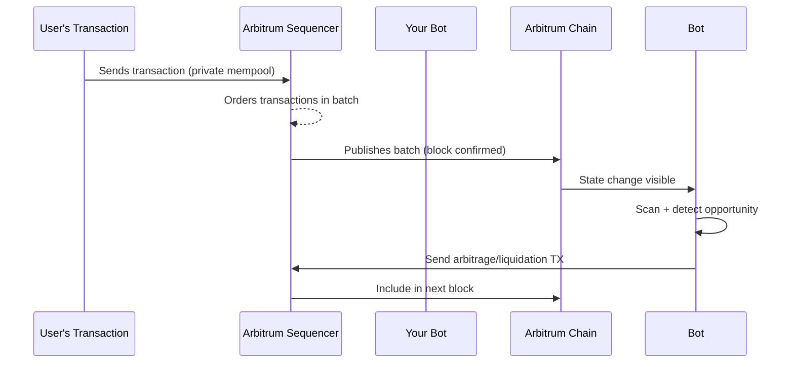

### 🏎️ Timeline of the Tactic

**1. Sequencer builds a batch (private mempool)**

* Arbitrum’s sequencer receives transactions directly from users and bots (not public).
* It orders them into a batch before anyone else sees them.
* At this stage, *revenant cannot see or react* — no public mempool access.

---

**2. Batch is published**

* The sequencer publishes the ordered batch to all nodes.
* This is the **first moment of visibility** — revenant now see the transactions in the block *after they’ve already executed*.
* The chain’s state (balances, reserves, oracles) is now updated.

---

**3. Detection phase (milliseconds–seconds)**

* revenant scans the just-published block:

  * Looks for liquidations triggered.
  * Detects big swaps that moved AMM prices.
  * Checks lending protocols for updated collateral/borrow ratios.
* This scan must be near-instant — speed is everything.

---

**4. Opportunity crafting**

* revenant bot computes if there’s a profitable move *given the new state*.
* Examples:

  * Arbitrage across DEXs after a large swap shifted prices.
  * Liquidation of an undercollateralized loan.
  * Leveraging updated oracle prices for delta-neutral trades.

---

**5. Reaction phase (next block race)**

* revenant bot immediately send it's transaction to the sequencer *for inclusion in the next block*.
* The race here is between revenant bot and **every other bot and searchers scanning the block** for the same opportunity.
* revenant can improve odds with:

  * **Fast RPC/WebSocket** to the sequencer.
  * **Pre-funded** gas and optimized bytecode.
  * **Priority fees** (if supported).

---

### 📊 Mermaid Diagram of the Flow

---

### 🔍 Why it works on Arbitrum

Even without a public mempool, the **delay between batch publication and next block inclusion** gives a small reaction window.
revenant is not *front-running*, revenant is *fast-following* — taking advantage of a new on-chain state before normal users or slower bots react.

---
