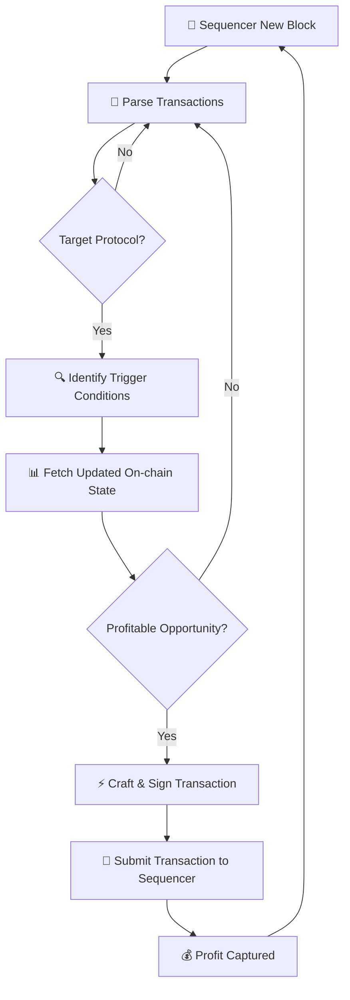

```mermaid
graph TD
    A[🔄 Sequencer New Block] --> B[📜 Parse Transactions]
    B --> C{Target Protocol?}
    C -- No --> B
    C -- Yes --> D[🔍 Identify Trigger Conditions]
    D --> E[📊 Fetch Updated On-chain State]
    E --> F{Profitable Opportunity?}
    F -- No --> B
    F -- Yes --> G[⚡ Craft & Sign Transaction]
    G --> H[🚀 Submit Transaction to Sequencer]
    H --> I[💰 Profit Captured]
    I --> A
```

